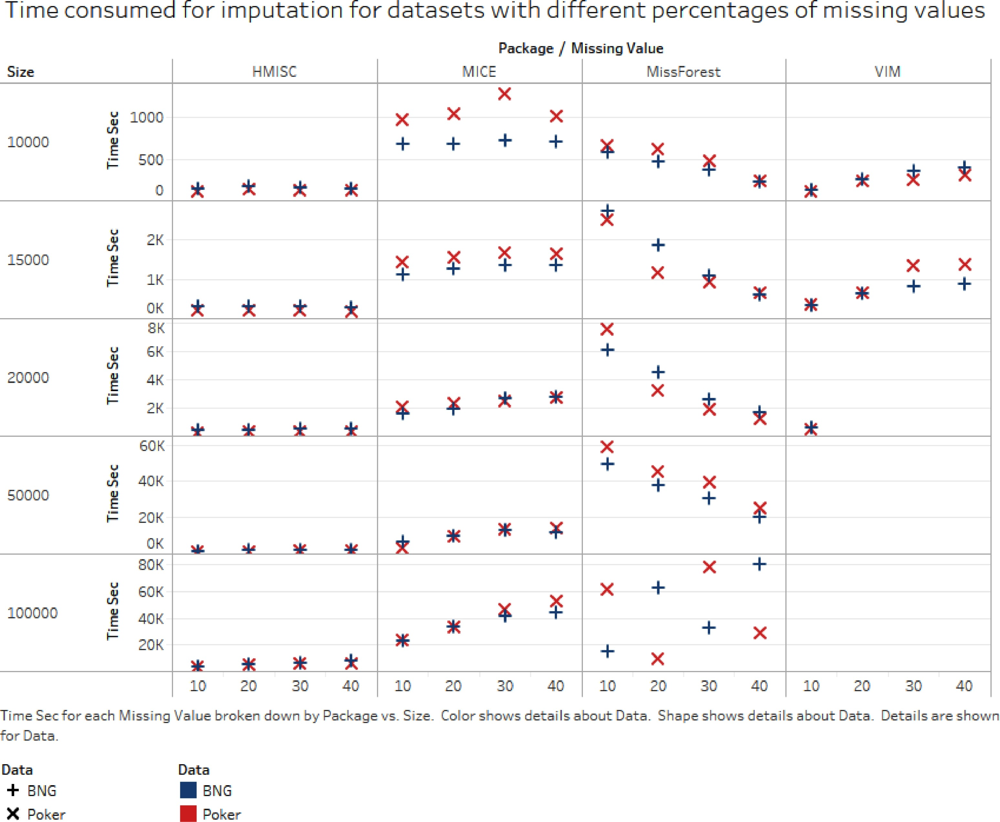
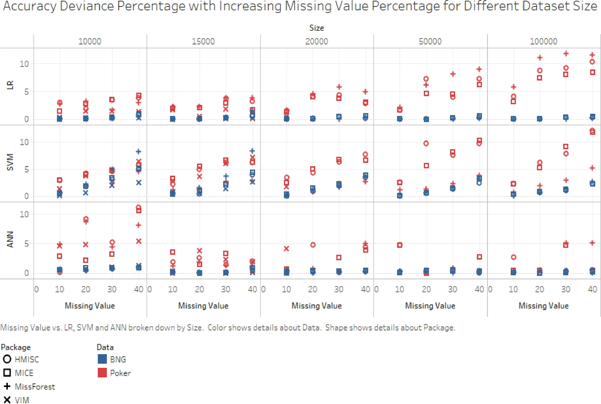

```{r setup, include=FALSE}
knitr::opts_chunk$set(dev = 'pdf', fig.height = 8)
par(mar=c(3,3,2,1), mgp=c(2,.7,0), tck=-.01,las=1)
```

## In this class ... 

- Missing data analysis on large data sets

- Introduction to `mlr`/`mlr3` and missingness

- Other packages that perform missing data analysis

- Further resources on missingness

## Large data missing data analysis

- In *omics data we often have number of variables greater than the number of samples (small $n$ large $p$)

- Absent missing data, the usual approaches involve dimension reduction, variable selection or regularisation approaches such as the lasso

- With (ignorable) MAR data we need to incorporate the approaches into the imputation model which can often require bespoke code

- With NMAR data, selection models possibly the best approach as the high-dimensional regression model can be left unchanged (though the classification model will get harder to fit)

- Other problems might occur if the target variables are high dimensional (not covered here)

## A high dimensional selection regression model

We might write such a model as:

$$y_i = f(X_i) + \epsilon,\; \epsilon \sim N(0, \sigma^2)$$
$$m_i \sim Bernoulli(p_i),\; \mbox{logit}(p_i) = \alpha + g(X_i) + \gamma y_i$$

- Now both $f$ and $g$ need to take account of the high-dimensionality of $X_i$

- For the Fully Conditional Specification (FCS) versions of these models, an $f_j$ will need to be proposed for every variable $y_i, X_{i1}, \ldots X_{ip}$

## Long data FCS

- Yadav _et al_, Handling missing values: A study of popular imputation packages in R, Knowledge-Based Systems,
2018
- Compared R packages `VIM`, `mice`, `MissForest`, and `HMISC`
- Created 'fake' datasets by sub-sampling two classification data sets to contain 10k to 100k rows, and introduced 10-40% missingness
- They don't seem to have worried about whether this was MCAR, MAR or NMAR
- They evaluated their methods based on:
    
    - The time taken to do the imputation
    - The predictive performance of the classifier on the 'complete' data set (not clear whether MI used)
    - The variance of the imputed values (compared to the known true variances of the variable)

## Results - time taken

```{r, echo = FALSE, out.width="65%", fig.align="center"}
library(knitr)

```

## Results - model performance

```{r, echo = FALSE, out.width="65%", fig.align="center"}
library(knitr)

```

## Fat data FCS

Consider a simulated data set of the form:
\small
```{r}
set.seed(123)
n = 100
p = 150
X = X_true = matrix(runif(n*p), nrow = n, ncol = p)
X[sample(1:(n*p), size = 0.3*n*p)] = NA
y = rnorm(n, 3 + 2*X_true[,1], sd = 1)
df = data.frame(y, X)
```
\normalsize
See what happens with mice
\small
```{r, eval = FALSE}
library(mice)
imp = mice(df, m = 1) # Not MI
```
\normalsize
- This took >2 minutes on my computer! Then:
\small

```
* A ridge penalty had to be used to calculate the inverse crossproduct 
of the predictor matrix. 
```

## Imputation and `mlr`

- The `mlr` package in R is one of, if not, the best package for machine learning in R
- Its main strength is extendibility - it allows for very many other R packages to be used as the ML tool 
- A new version `mlr3` has just been released but has only a small feature set right now (e.g. no imputation yet)
- The language of `mlr` is:

    - A __task__ is a data set with a target and features
    - A __learner__ is a machine learning tool such as linear regression, random forests or a neural network

- Full list of learners at: https://mlr.mlr-org.com/articles/tutorial/integrated_learners.html (over 150 at last count)

## A simple `mlr` example

```{r, message=FALSE}
library(mlr)
data(BostonHousing, package = "mlbench")
bh_task = makeRegrTask(data = BostonHousing, target = "medv")
bh_learner = makeLearner("regr.lm")
bh_train = mlr::train(bh_learner, bh_task)
getLearnerModel(bh_train)
```

## MAR with `mlr`

- Some packages associated with `mlr` allow for missing values in the features. These are essentially treating the missingness as ignorable and working around it

\tiny
```{r}
listLearners("regr", properties = "missings")[c("class", "package")]
```
\normalsize

- Note: there are no packages that allow missing values for cluster analysis in `mlr`

## Imputation with mlr

- If you want to run a learner that doesn't allow for missing values you will need to impute values before you run the model

- No way (that I can see) to use multiple imputation

- Let's use the `airquality` data set:

```{r}
data(airquality)
str(airquality)
```

## Imputation with mlr (cont)

- Imputation via the `impute` function

\small
```{r}
imp = impute(airquality, classes = list(integer = imputeMean(), 
                                        factor = imputeMode()))
str(imp$data)
```
\normalsize

Notice also the dummy variables

- You can also impute based on individual variables, or based on your own functions


## Imputation with mlr (cont 2)

- To do this properly in an ML environment you should:

  - Only perform the imputation on the training set (not the full data set)
  - Not use the target variable in the imputation approach
  
- In `mlr` we would specify this as: 

```{r}
imp = impute(airquality, target = "Ozone")
```

- This also gives you a `reimpute` function to use the same imputation method on the test data before you perform the test set predictions

## Other packages that perform multiple imputation via ML

- There are packages that will perform single or multiple imputations based on supervised ML approaches

- Some of the most common ones are:

    - `hmlasso`: high missing rate lasso. Performs high dimensionsal regression on ignorable missingness
    - `missRanger` and `missForest`. These use the random forest packages to fill in the missing values via FCS as in `mice`. Running them multiple times gives multiple imputations which can then be `pool`ed using `mice`.
    - `VIM` Visualisation and imputation of missing values. Very similar to (but slightly smaller than) `mice`. Has some nice plots and multiple imputation tools

- More generally a huge list of approaches at https://cran.r-project.org/web/views/MissingData.html

## Clustering with missing values via `VarSelLCM`

- There is a package `VarSelLCM` that will perform model-based clustering (and variable selection) when some of the data are missing
- The text states that this only works when the data are MCAR, but I suspect that they mean ignorable

Reminder:

- Standard model-based clustering assumes that the data follow a mixture of multivariate normal distributions

$$P(y_{i1}, \ldots, y_{ip}) = \sum_{k=1}^K \pi_{ik} MVN(y_{i}; \mu_k, \Sigma_k)$$

- The standard task is to estimate the mean $\mu_k$ and covariance matrix $\Sigma_k$ for each cluster, and the probability that each observation belongs to cluster $k$, which is $\pi_{ik}$

- We can do this using Bayes or EM (or many other algorithms)

## Example of a cluster analysis:

```{r, message=FALSE}
library(VarSelLCM)
data(faithful)
faithful[1,1] = NA # Just to show it works with NAs
res = VarSelCluster(faithful, gvals = 2, vbleSelec = FALSE, crit.varsel = "BIC")
```

```{r, echo = FALSE, message = FALSE, fig.height = 4}
library(mixtools)
plot(faithful)
points(res@param@paramContinuous@mu[1,], res@param@paramContinuous@mu[2,], col = 'red', pch = 19)
ellipse(mu=res@param@paramContinuous@mu[,1], sigma=diag(res@param@paramContinuous@sd[,1]), 
        alpha = .5, npoints = 250, col="red") 
ellipse(mu=res@param@paramContinuous@mu[,2], sigma=diag(res@param@paramContinuous@sd[,2]), 
        alpha = .5, npoints = 250, col="red") 
```

- There are many other good cluster analysis packages (e.g. `mclust`), but most of them will not work with missing data!

## Multiple imputation inside machine learning

- This subject is not very well developed and is an active area of research

- Some advise creating the 'long' data format from `mice` with 10 repetitions of the data set and running the model on this. I would strongly caution against this approach

- Others advise running the machine learning model on each imputed data set, then averaging the predictions across them. This seems better but, like the `mice` approach, will be sensitive to the number of imputations when the missing rate is high, and is inappropriate when we are interested in probabilistic predictions

- I could not find a single package (other than `mice`) that would pool models together accounting for multiple imputations. Even `mice` only seems to work on simple models (e.g. `lm` and `glm`)

## A summary of the course

::: columns

:::: column

Do:
\vspace{0.5cm}

- Think about your missingness mechanism.

- Impute multiple times

- Use `mice` or Bayes. There are lots of Bayesian packages (not just JAGS and Stan)


::::

:::: column

Don't:
\vspace{0.5cm}

- Use single imputation

- Fit machine learning or statistical models without taking account of the uncertainty in the missing values

::::

:::

\vspace{1cm}

If the missingness mechanism is ignorable, you just need to be careful setting up the model. If not ignorable think about which type (Selection or Pattern Mixture) approach is most appropriate and incorporate the extra assumptions carefully

## Some final other resources

- The mice book: https://stefvanbuuren.name/fimd/

- My other courses on GitHub:

    - Bayesian Hierarchical Modelling: andrewcparnell.github.io/bhm_course/
    - Time Series models: https://github.com/andrewcparnell/ecots
    - Advanced R: https://andrewcparnell.github.io/Rfternoon/

- A load of JAGS examples:

    - https://github.com/andrewcparnell/jags_examples

Let's do some coding!


